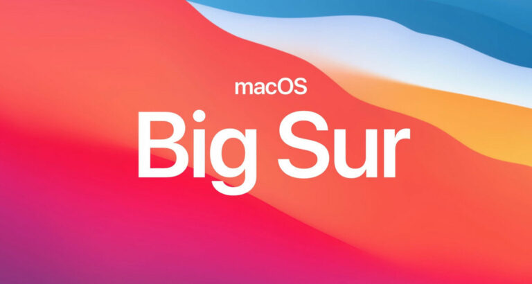

# GL553VD MacOS

Jakub's fork of [MohammadtaghiFarkhondekar Clover](https://github.com/MohammadtaghiFarkhondekar/macOS-For-Asus-ROG-GL553VD), which plans to include OpenCore Bootloader to MacOS and support configurations up to 2022 year. Confiugration was currently tested by me on **Mojave 10.14** and **Catalina 10.15** with planned support for **BigSur** in near time.



---

## Installation Guide

> From: MohammadtaghiFarkhondekar

After installing open terminal and run this Command and reboot system.

```
sudo kextcache -i /
sudo touch /System/Library/Extensions/ && sudo kextcache -u/
```

For using Asus Aura Core keyboard you can use https://github.com/hieplpvip/macrogaura/

## Configuration Specification

Information about KEXTs used to build configuration for GL553VD.

### Hardware Status

Information about supported elements and these things that doesn't work on GL553VD.

| Device        |                        Name                         | working in macOS |
| :------------ | :-------------------------------------------------: | ---------------: |
| Processor     |         Intel® Core™ i7 7700HQ or i5 7300HQ         |              YES |
| Chipset       |            Intel® HM175 Express Chipset             |              YES |
| Memory        |     up to 32 GB SDRAM, 2 x SO-DIMM socket DDR4      |              YES |
| Graphic       |               INTEL HD 630 - 2GB VRAM               |              YES |
| Graphic       |               NVIDIA GeForce GTX 1050               |            NEVER |
| Audio         |                     ALC233(235)                     |              YES |
| Storage       |        SSD SATA3,PCIE Gen3X4 SSD,Hard Drives        |              YES |
| Optical Drive |                   Super-Multi DVD                   |              YES |
| Keyboard      |                      ASUS AURA                      |          10.14.x |
| Card Reader   |                 RTS5229 PCI Express                 |              YES |
| WebCam        |                    USB2.0 HD UVC                    |              YES |
| Networking    | Realtek RTL8168H/8111H PCI Express Gigabit Ethernet |              YES |
| Networking    |                    Intel AC7260                     |          Depends |
| Bluetooth     |                    Intel AC7260                     |              YES |
| Battery       |                   4 Cells Battery                   |              YES |
| USB           |                     USB 3.0 Bus                     |              YES |
| HDMI          |                  INTEL HDMI HD 630                  |              YES |
| Touchpad      |                      ELAN 1200                      |              YES |

## Resources

External informations related for building MacOS on GL553VD.

## Credits

- [Mohammadtaghi Farkhondekarsahih](https://github.com/MohammadtaghiFarkhondekar), for building intial versions of Clover and maintining them.
